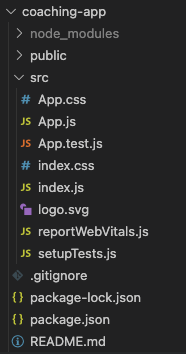
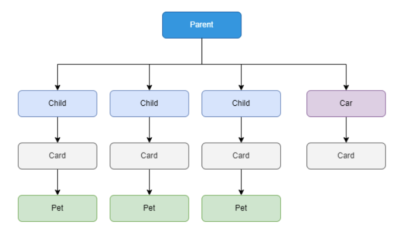
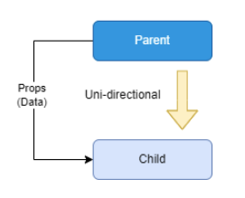

# Coaching | SCTP in SE | Module 2 | React Week 1

## Coverage

1. Basic JavaScript
1. React Project Structure
1. What is JSX?
1. What are Components in React?
1. What are Props?

<details>
<summary>1. Basic JavaScript</summary>
## 1. Basic JavaScript

1. Which of the following is **NOT** primitive data type of JavaScript?

```
A: string
B: int
C: object
D: boolean
```

2. Which of the following JavaScript feature(s) are used for performing conditional flow?

```
A: for
B: if
C: switch
D: while
```

3. Which of the following JavaScript feature(s) are used for performing looping?

```
A: for
B: if
C: switch
D: while
```

4. Refer to the different way of writing functions in JavaScript:

```js
// Declarative Function:
function declarativeFn () {}

// Function Expression:
const expressionFn = function () {}

// Arrow Function:
const arrowFn = () => {}
```

What is the difference between Declarative Function, Function Expression, and Arrow Function?

```
A: Syntax
B: Declarative Function is hoisted
C: Only Function Expressiong can be passed as argument
D: All of the above
```

5. What is the difference between the following array iteration method?

```js
// ForEach
[1,2,3,4,5].forEach((value, index) => {
    console.log(value, index);
})

// Map
const multiplied = [1,2,3,4,5].map((value, index) => {
    return value * 10;
})
```
</details>

<details>
<summary> 2. React Project Structure</summary>
## 2. React Project Structure

This illustration is an output of `npx create-react-app coaching-app` command:



Here are some key knowledge you should know as a start:

|Folder or File|Purpose|
|-|-|
|package.json|Contains project manifest and dependencies information.|
|node_modules|Stores files of dependencies downloaded with command: `npm install <dependency>`.|
|src|Stores your code, mainly JavaScript or TypeScript files.|
|public|Stores static files that are not processed by bundler/webpack.|
|build|Artifact produced after running command: `npm run build`|

</details>

<details>
<summary> 3. What is JSX?</summary>
## 3. What is JSX?

JSX (JavaScript XML) is a syntax extension for JavaScript, most commonly used with React to describe what the UI should look like. JSX allows you to write HTML elements in JavaScript.


```html
<div class="header-1">My Profile</div>
```

```js
function Component(){
    return (
        <div className={"header-1"}>My Profile</div>
    )
}
```

| Feature | HTML | JSX |
|---------|------|-----|
| **Syntax** | Standard markup language for creating web pages. Familiar to most web developers. | XML/HTML-like syntax integrated within JavaScript. Requires a compilation step (e.g., Babel) to convert into JavaScript. |
| **Integration with JS** | JavaScript code can be embedded using `<script>` tags or external files, but HTML itself is separate from JavaScript logic. | Allows JavaScript expressions to be embedded directly within the markup using curly braces `{}`. This provides a more integrated approach to building UI components. |
| **Learning Curve** | Lower for beginners in web development. HTML is the foundational block of web development. | Slightly higher due to the need to understand both JavaScript and the way JSX blends markup with JavaScript logic. |
| **Ecosystem Compatibility** | Universally supported across all web browsers and development environments. | Primarily used with React (and some other frameworks/libraries). Requires a build process with tools like Babel and Webpack. |
| **Performance** | Directly interpreted by the browser. Performance depends on the browser's rendering engine. | Transpiled to optimized JavaScript code which can be fine-tuned for performance, especially in complex applications. |
| **Debugging** | Errors can be directly traced in HTML files, but interactive behavior debugging requires checking the associated JavaScript. | Compilation step can introduce additional complexity in debugging, though source maps can help trace errors back to the original source code. |
| **Dynamic Content** | Dynamic content requires explicit DOM manipulation or integration with JavaScript frameworks/libraries. | Facilitates the creation of dynamic content and interactive UIs by seamlessly integrating with JavaScript logic. |
| **Component-Based Architecture** | Not inherently designed for a component-based architecture. Requires integration with frameworks (e.g., Angular, Vue) for component-driven development. | Naturally supports a component-based architecture, making it ideal for developing reusable UI components in applications. |

</details>

<details>
<summary> 4. What are Components in React?</summary>
## 4. What are Components in React?

In React, components are the building blocks of the user interface (UI). A component represents a part of the UI that is reusable and can manage its own state or be stateless. React encourages the development of UIs as a composition of small, isolated, and reusable components that manage their own state. These components can be composed together to build complex UIs.



A React Component is defined as a function that returns JSX:

```js
function Component(){
    return (
        <div className={"header-1"}>My Profile</div>
    )
}
```

### Component Life Cycle

| Lifecycle Equivalent|Common Use Case|
|-|-|
| **Mounting** | Fetch data that is required by the component. |
| **Unmounting** | Cleanup operations before the component is removed from the UI. Such as cleaning up active connections to preserve backend resources.| 
| **Updating** | Operations that need to run in response to specific state or prop changes. Such as showing error messages when a form submission fails.| 

</details>

<details>
<summary> 5. What are Props?</summary>
## 5. What are Props?

Props are data passed from parent component to child component.



Child Component
```js
import React from 'react';

function ChildComponent(props) {
  // Accessing the message prop passed from ParentComponent
  return (
    <div>
      <h3>Child Component</h3>
      <p>{props.message}</p> {/* Displaying the message */}
    </div>
  );
}

export default ChildComponent;

```

Parent Component
```js
import React from 'react';
import ChildComponent from './ChildComponent';

function ParentComponent() {
  const message = "Hello from Parent!";

  return (
    <div>
      <h2>Parent Component</h2>
      {/* Passing message prop to ChildComponent */}
      <ChildComponent message={message} />
    </div>
  );
}

export default ParentComponent;

```

- The ParentComponent defines a message variable and passes it to the ChildComponent as a prop named message.
- The ChildComponent receives the props object, which contains all the props passed from the parent. It then accesses the message prop and renders it inside a <p> tag.
- This pattern demonstrates how data flows from parent to child components through props, allowing child components to render data passed down from their parents.
</details>

END